# API Endpoints – Screenshots (Simple)

Put all images under `./screenshots/` and replace filenames if needed.

## GET /health
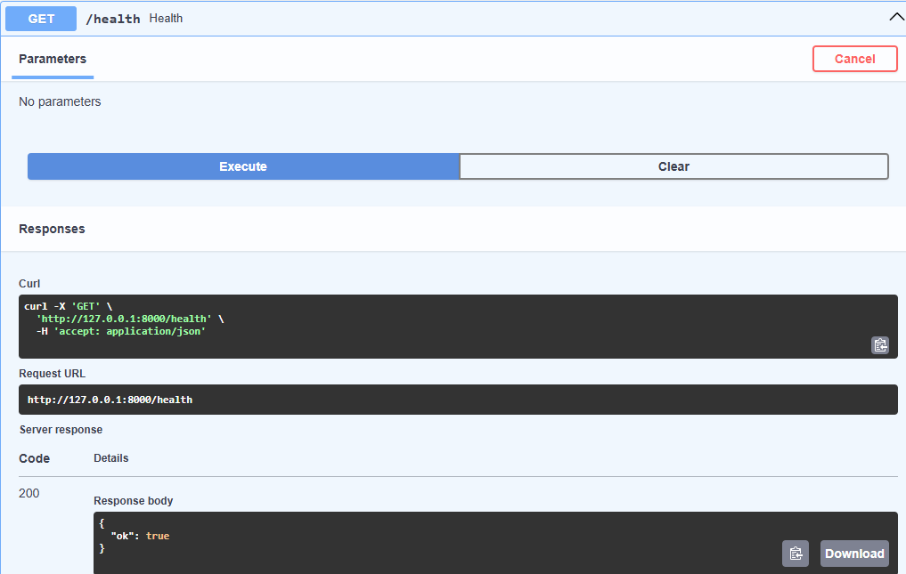

## POST /signup
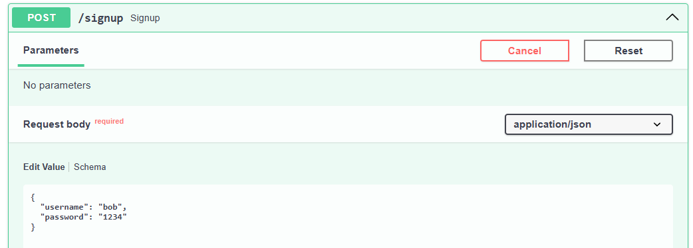

## POST /login
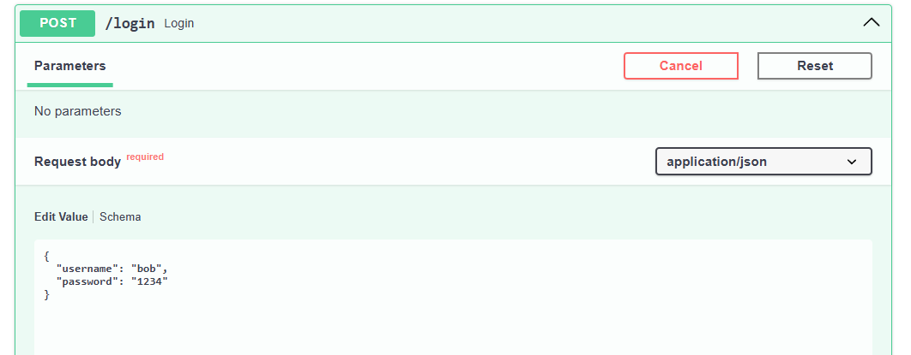

## bearer
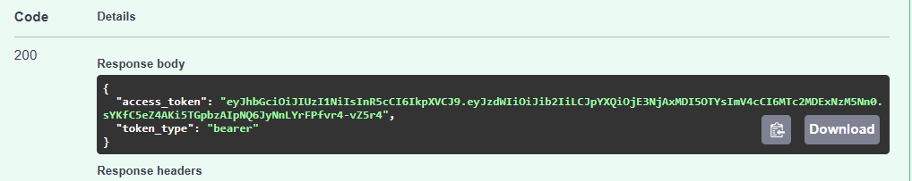
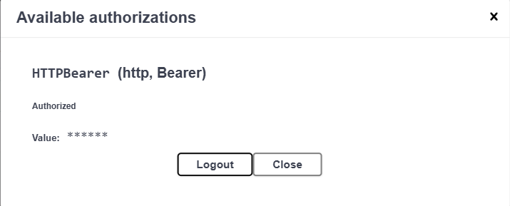

## POST /add_tokens
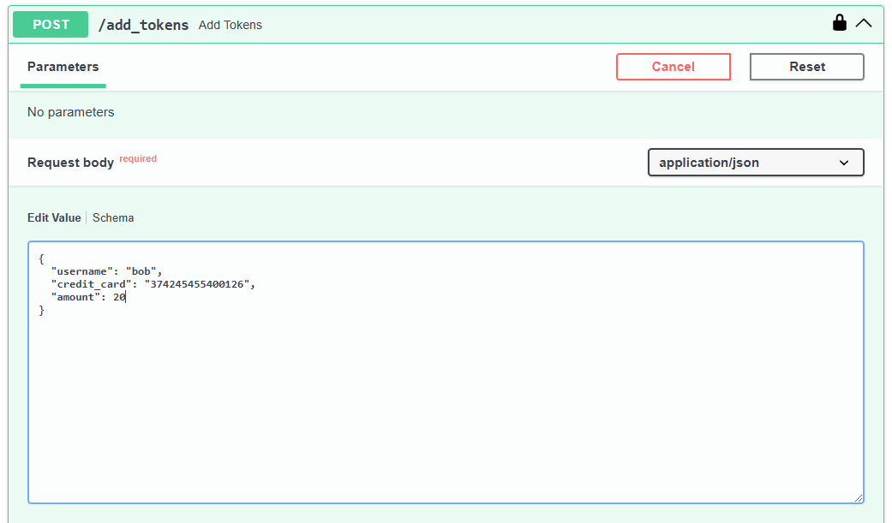

## GET /tokens/{username}
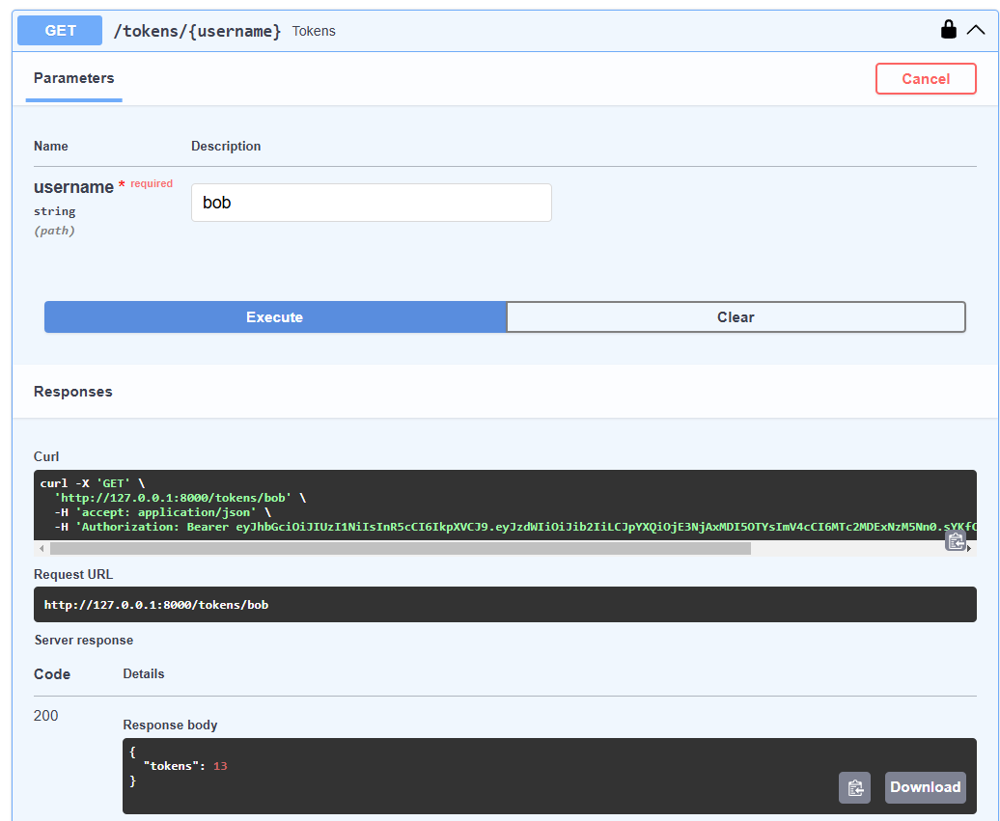

## POST /train
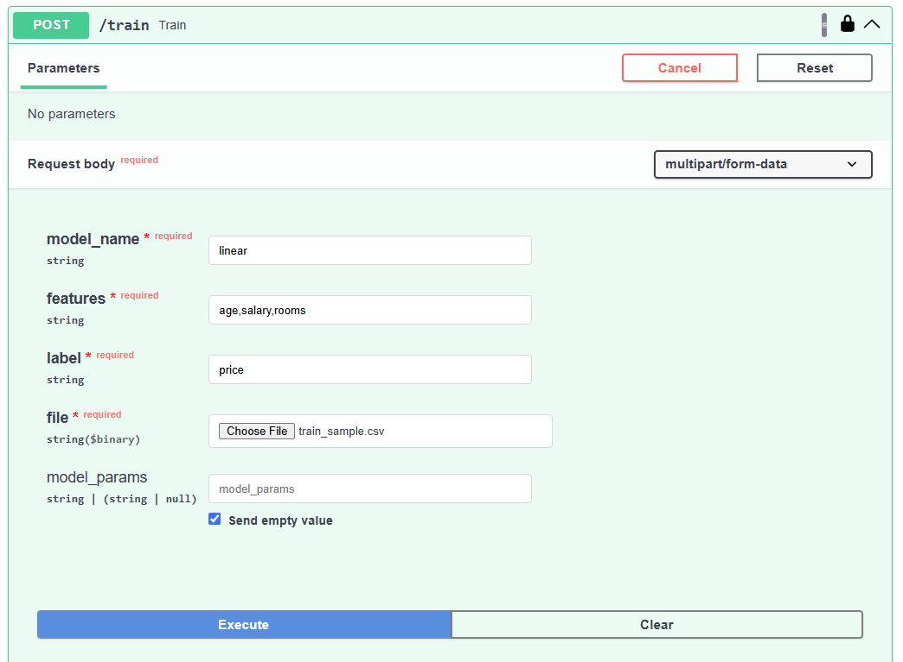
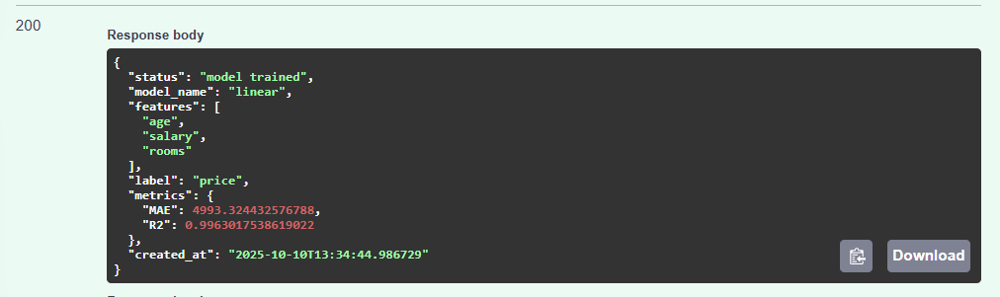

## GET /models
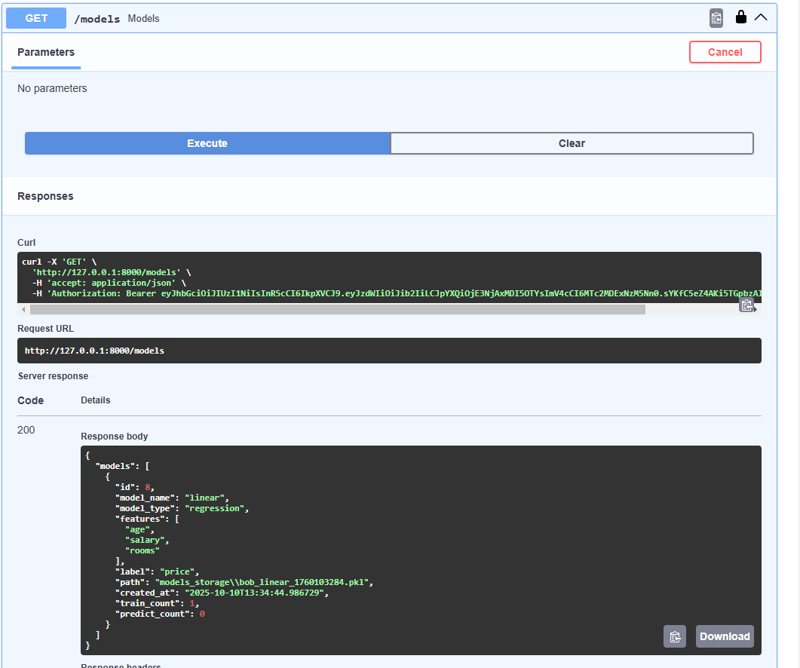

## POST /predict/{model_name}
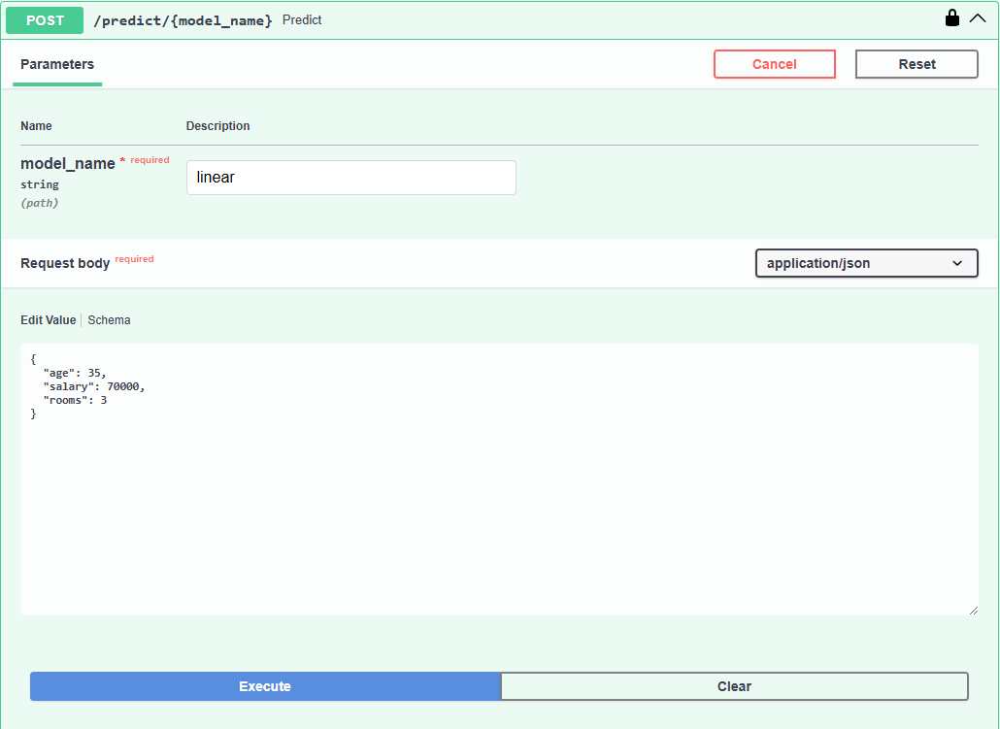
## Response
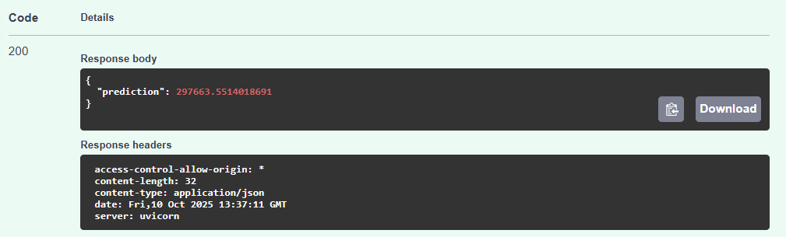

## DELETE /remove_user
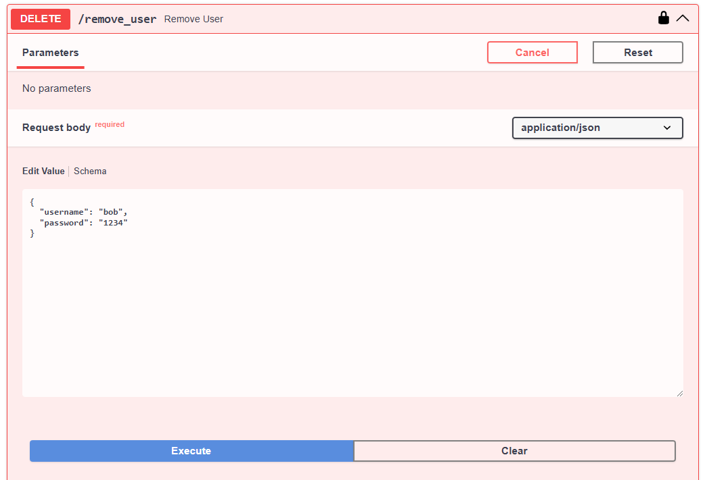

## Streamlit Dashboard
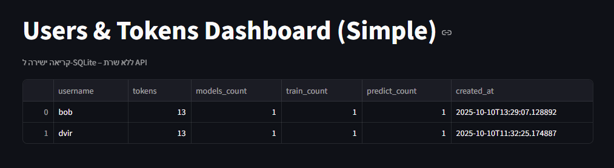
## Streamlit Dashboard After Delete
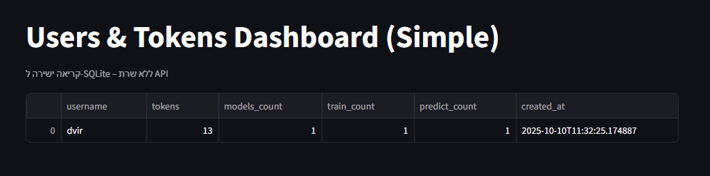
